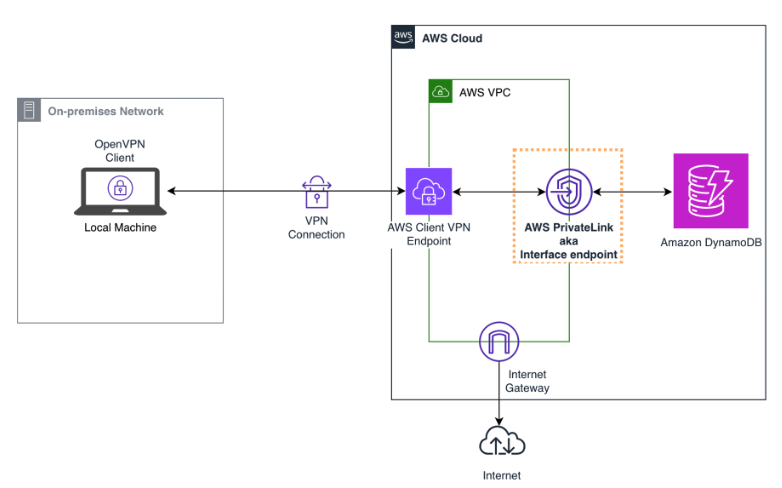

# Using Terraform to build an AWS Client VPN with access to a DynamoDB Interface Endpoint
This project demonstrates how to use Terraform to build a DynamoDB Interface endpoint powered by AWS PrivateLink. AWS PrivateLink support for DynamoDB enables direct hybrid private access to DynamoDB resources from on-prem without setting up a proxy in the VPC. We will demonstrate hybrid connectivity to DynamoDB using AWS VPN Client.

## Prerequisites
Before you begin, ensure you have the following:

- AWS account
- Terraform installed locally
- AWS CLI installed and configured with appropriate access credentials

## Architecture


---

## Project Structure
```bash
|- src/
	|- archives/
  |- events/
	|- handlers/
|- provider.tf
|- terraform.tfvars.tf
|- variables.tf
|- vpc.tf
|- security-groups.tf
|- apigw.tf
|- ec2.tf
```
---
## Getting Started

1. Clone this repository:

   ```bash
   git clone https://github.com/FonNkwenti/tf-ddb-privateLink.git
   ```
2. Navigate to the project directory:
   ```bash
   cd tf-ddb-privateLink
   ```
3. Initialize Terraform:
   ```bash
   terraform init
   ```
4. Review and modify `variables.tf` to customize your API configurations.
5. Create a `terraform.tfvars` file in the root directory and pass in values for `region`, `account_id`, `tag_environment` and `tag_project`
   ```bash
    region               = "eu-central-1"
    account_id           = <<your account id>>
    tag_environment      = "dev"
    tag_project          = "tf-ddb-privateLink"
   ```
6. Apply the Terraform configure:
   ```bash
   terraform apply
   ```
7. After the apply is complete, Terraform will output the private API Gateway URL which can be used to access the private Serverless REST API endpoints.

---

## Clean up
Remove all resources created by Terraform.
   ```
   terraform destroy
   ```

---


## License

This project is licensed under the MIT License - see the `LICENSE` file for details.
